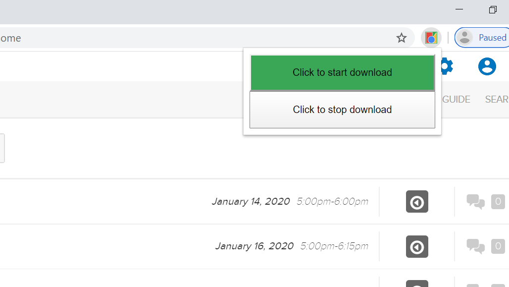

# echo360-bulk-downloader
Taken from Bharat's original extension [here](https://github.com/bmiddha/echo360-bulk-downloader).  
The code automated bulk download but could only be used by copying and pasting code in web console

## Modifications
1. For easy usage, made a chrome extension using Javascipt.  
2. Used HTML/CSS to make two buttons to start and stop bulk download

## Screenshot

